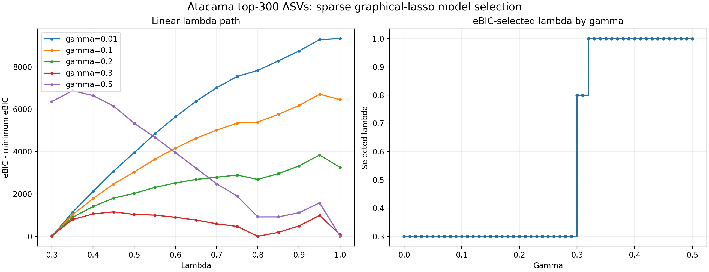
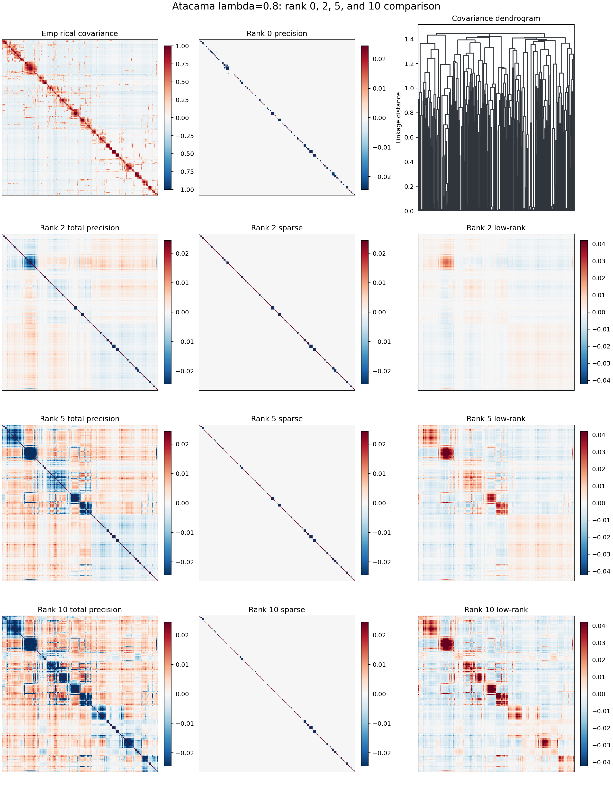
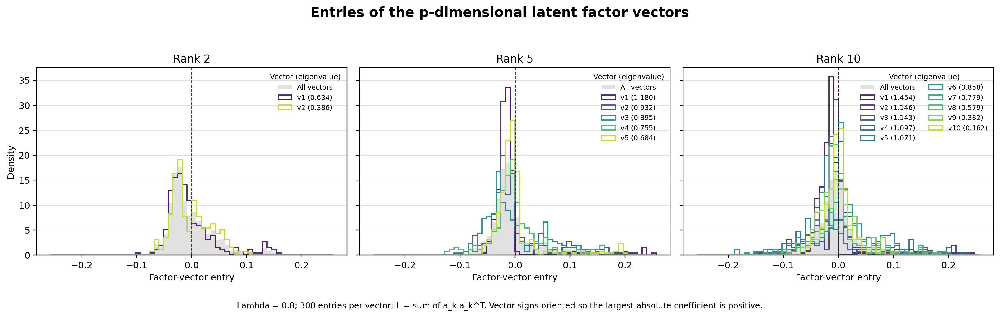

# High-Dimensional Example: 300 Atacama ASVs

The chapters above use a small 13-ASV subset to keep every step easy to follow.
This chapter scales the same q2-gglasso workflow to a **high-dimensional**
setting — the **300 most abundant ASVs** across **54 samples** of the Atacama
soil microbiome — and selects the regularization parameters with an explicit
model-selection criterion. It reproduces the reference analysis prepared by
Christian L. Müller.

## Data

Starting from the full Atacama tutorial table, samples are matched and the
**300 ASVs with the greatest total abundance** are retained ($n = 54$ samples,
$p = 300$ features; the resulting table has 49,252 counts and is 5.9% non-zero).
The empirical correlation matrix of the clr-transformed table
(`atacama-top-300-correlation.qza`) is the input to the graphical lasso.

## Single graphical lasso: selecting $\lambda$ with eBIC

For a high-dimensional network we choose the sparsity penalty $\lambda_1$ with
the **extended Bayesian Information Criterion** (eBIC). The extra parameter
$\gamma \in [0, 1]$ controls how strongly extra edges are penalized: Foygel and
Drton use $\gamma = 0.5$ as the conventional choice, while the small-example
default `--p-gamma 0.01` is tailored to the toy table. For this analysis we use
a moderate **$\gamma = 0.3$**, evaluated on a **linear** $\lambda$ path running
from `1.00` down to `0.30` in steps of `0.05` — 15 points:

```bash
qiime gglasso solve-problem \
    --i-covariance-matrix atacama-top-300-correlation.qza \
    --p-n-samples 54 \
    --p-no-latent \
    --p-path-scale linear \
    --p-lambda1-min 0.30 --p-lambda1-max 1.00 --p-n-lambda1 15 \
    --p-gamma 0.3 \
    --o-solution atacama-top-300-sgl-linear-path.qza
```

`--p-path-scale linear` is what makes this an evenly-spaced grid; the default is
`log`. Passing the grid explicitly with `--p-lambda1-path` is equivalent.

Along this path the **minimum eBIC occurs at $\lambda = 0.8$**, which defines the
sparse network with **216 edges**:



```{csv-table} eBIC across the linear $\lambda$ path
:file: ../../_data/atacama-lambda-path.tsv
:delim: tab
:header-rows: 1
:widths: 20, 40, 20
```

```{note}
This table is **generated**, not transcribed. The generator is not in this book:
`slurm/01_lambda_path.sh` lives in the companion `q2-hdstats-recompute` tree and
writes `results/tables/lambda-path.tsv` with columns `lambda1 / sparsity / ebic`
straight out of the solution artifact. `docs/_data/atacama-lambda-path.tsv` is
that file re-expressed as `lambda / eBIC (gamma=0.3) / edges`, with the edge
counts derived from the reported sparsity as
$\text{density} \times \binom{300}{2}$. That conversion is a hand step, so the
prose above *can* drift from the numbers below — check both against
`results/tables/lambda-path.tsv` after any re-run rather than trusting the
pipeline to keep them in step.
```

The choice of $\gamma$ matters: $\gamma \in [0.30, 0.31]$ selects $\lambda = 0.8$
(216 edges); $\gamma \le 0.29$ selects the much denser $\lambda = 0.3$
(1405 edges); and $\gamma \ge 0.32$ selects the empty $\lambda = 1.0$ network.

```{note}
**On reproducibility across the path.** The CLI run reproduces the original
reference analysis exactly at 11 of the 14 non-empty grid points — including the
whole sparse end and, critically, the selected $\lambda = 0.8$ at 216 edges. Three
points at the dense end differ by one or two edges: $\lambda = 0.55$ (819 vs 820),
$\lambda = 0.35$ (1350 vs 1348) and $\lambda = 0.3$ (1405 vs 1403). The numbers
above and in the table are the **current** run.

Two things could produce a difference that small in the dense regime, and the
path artifact does not retain enough information to separate them: genuine solver
variation where many entries sit near the sparsity threshold, or rounding in the
edge counts, which are derived from the reported density rather than counted from
each grid point's precision matrix. Neither affects the selection — the eBIC
minimum is at $\lambda = 0.8$ either way, and agrees with the reference to eight
significant figures.
```

## Sparse + low-rank: comparing ranks 2, 5 and 10

At the selected $\lambda = 0.8$ we add a low-rank latent component and compare
target ranks **2, 5 and 10**. In the current release the rank is not set
directly; it is controlled through the low-rank penalty $\mu_1$ (a larger
$\mu_1$ yields a smaller rank). We therefore **scout** $\mu_1$ until the fitted
`rank(lowrank_)` matches each target:

| Model | $\mu_1$ | sparse edges | connected nodes |
|-------|---------|--------------|-----------------|
| Sparse only (rank 0) | — | 216 | 163 |
| Sparse + low-rank, rank 2 | 15.0 | 202 | 162 |
| Sparse + low-rank, rank 5 | 10.0 | 158 | 124 |
| Sparse + low-rank, rank 10 | 7.5 | 110 | 92 |

```bash
# rank 2 (mu1 = 15); repeat with mu1 = 10 for rank 5, mu1 = 7.5 for rank 10
qiime gglasso solve-problem \
    --i-covariance-matrix atacama-top-300-correlation.qza \
    --p-n-samples 54 \
    --p-latent \
    --p-lambda1-min 0.8 --p-lambda1-max 0.8 --p-n-lambda1 1 \
    --p-lambda2-min 0.1 --p-lambda2-max 0.1 --p-n-lambda2 1 \
    --p-mu1-min 15 --p-mu1-max 15 --p-n-mu1 1 \
    --o-solution atacama-top-300-slr-lambda0.8-rank2.qza
```

The `--p-lambda2-*` triple pins the second penalty to a single value. It is
inert for a single-graph problem, but omitting it leaves `lambda2` on a
five-point default path, which turns this single fit into a model-selection run;
see [Choosing the Latent Rank](03_slr_ranks.md).



**Rank 2 is the parsimonious choice.** Its two latent components already capture
the dominant measured-covariate structure, while ranks 5 and 10 mostly add
higher-dimensional detail. Across the downstream prediction tasks, the strength
of each task's association with the robust principal components tracks the
energy of its log-contrast coefficients in the rank-2 latent subspace (Spearman
$\rho = 0.90$, $p = 6\times10^{-5}$), confirming that two latent dimensions are
sufficient.

The low-rank component's eigenvectors give per-ASV loadings on the latent axes:



> **Choosing $\mu_1$ / the low-rank rank.** Until q2-gglasso exposes an explicit
> `--p-rank` (registered but currently guarded, pending upstream GGLasso
> support), select the rank indirectly: fit the SLR model for a few $\mu_1$
> values at the chosen $\lambda$, read the achieved `rank(lowrank_)` from each
> solution, and keep the $\mu_1$ that reaches your target rank. For this dataset
> that yields $\mu_1 = 15, 10, 7.5$ for ranks $2, 5, 10$, and rank 2 is enough.
